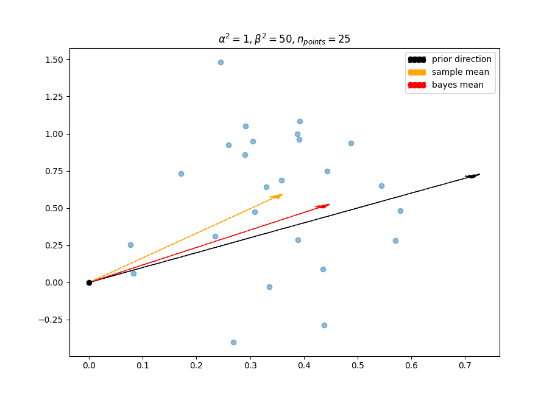
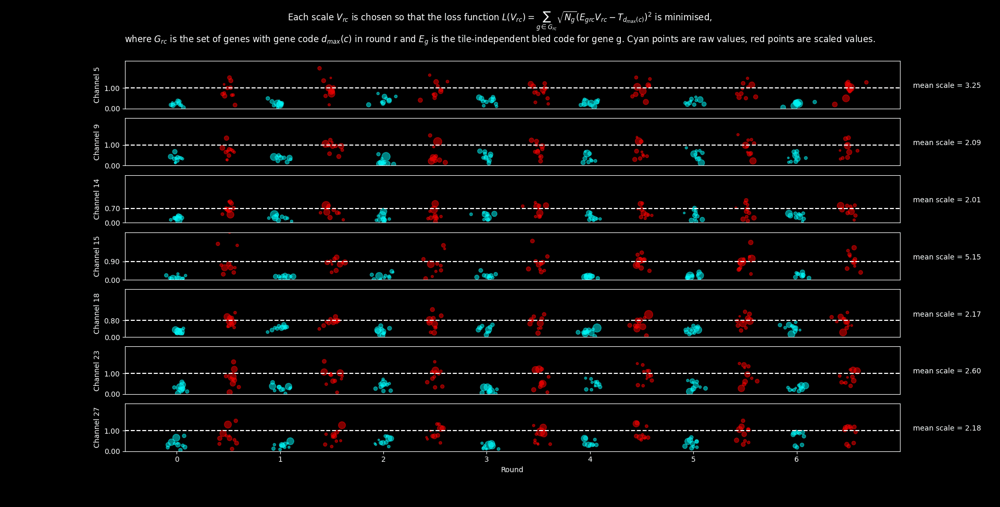
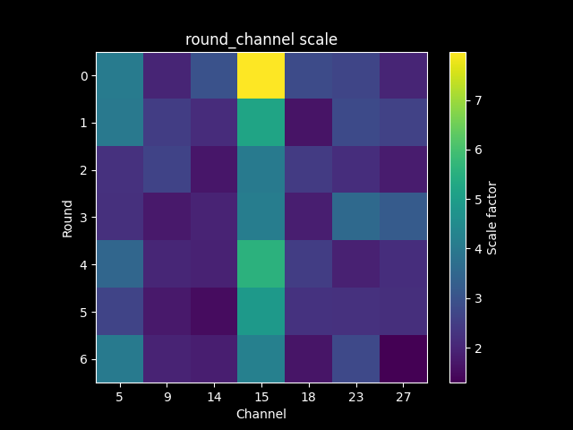
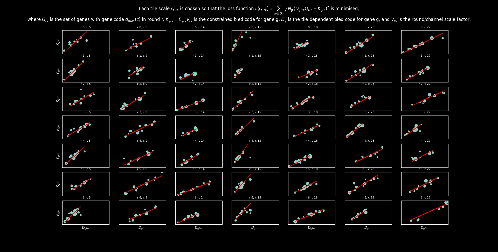
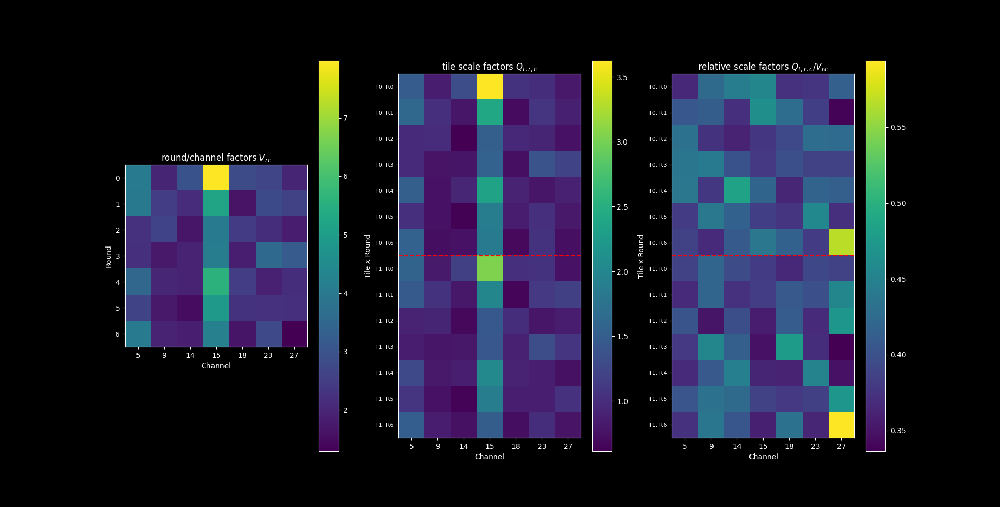

## Call Spots

The Call Reference Spots section of the pipeline is a method of gene calling which runs quickly on a small set of spots  ($\approx$ 50, 000 per tile) of the anchor image. Initially, this was our final mode of gene calling, but has since been superseded by OMP, which differs from Call Spots in that it runs on several more spots. That being said, the call spots section is still a crucial part of the pipeline as it estimates several important parameters used in the OMP section.

Some of the most important exported parameters of this section are:

- **Bleed Matrix** $\mathbf{B}$: $(n_{\text{d}} \times n_{\text{c}})$ array of the typical channel spectrum of each dye.

- **Colour Normalisation Factor** $\mathbf{A}$:  $(n_{\text{t}} \times n_{\text{r}} \times n_{\text{c}})$ array which multiplies the colours to minimise any systematic brightness variability between different tiles, rounds and channels, and maximise spectral separation of dyes,

- **Bled Codes** $\mathbf{K}$: $(n_{\text{g}} \times n_{\text{r}} \times n_{\text{c}})$ array of the expected colour spectrum for each gene.

### Algorithm Breakdown

<figure markdown="span">
  
</figure>
*Algorithm Flowchart showing how all variables and steps of the pipeline are related.*

The inputs to the algorithm are:

- Raw spot colours $F_{s, r, c}$ for all spots $s$ (defined as local maxima of round $r_{\text{anchor}}$, channel $c_{\text{anchor}}$)

- The tiles $t_s$ each spot $s$ was detected on

- A binary code array $\mathbf{C}$ of shape $(n_g \times n_r \times n_{dyes})$ which is defined as follows

$$
C_{g, r, d }= 
\begin{cases}
  1 & \text{if } \text{gene g has dye d in round r} \\ \\
0 & \text{otherwise}
\end{cases}
$$
 
- A raw bleed matrix $\mathbf{B_{raw}}$ of shape $(n_{\text{dyes}} \times n_{\text{c}})$ obtained from images of free-floating drops of each dye.

#### 0: Preprocessing
The purpose of this step is to convert our raw pixels from integers between -15,000 and 50,000 to floating points numbers. We want to minimise the influence of variable brightness between different tiles, rounds and channels, and get rid of background fluorescence as much as possible. 

We transform the raw spot colours via the following function:

$$F_{s,r,c} \mapsto P_{t(s), r, c}F_{s,r,c} - \beta_{s,c}.$$ 

In the formula above:

- $F_{s,r,c}$ is the raw spot colour for spot $s$ in round $r$ and channel $c$, 

- $P_{t,r,c} = 1/\text{Percentile}_s(F_{s, r, c}, 95)$ for all spots in tile $t$ is the initial normalisation factor. For 7 dyes, $\approx 1/ 7 \approx 15\%$ of spots in round $r$ are expected to be brightest in channel $c$. So this is normalising by the average intensity of a bright spot in this $(t, r, c)$, 

- $\beta_{s,c} = \text{Percentile}_s(P_{t(s),r,c} F_{s, r, c}, 25)$, where the percentile is taken across rounds. For 7 rounds, this is the second brightest entry of channel $c$ across rounds. This is a rough estimate of the background brightness of spot $s$ in channel $c$ after scaling by $\mathbf{P}$.

%TODO: Add an image of a spot before anything, after scaling, then after removing background

#### 1: Initial Gene Assignment
The purpose of this step is to provide some gene assignments that will facilitate further calculations. This is necessary as there are many important variables (eg: tile-independent free bled codes for each gene $E_{g,r,c}$ or the tile-dependent free bled codes $D_{g,t,r,c}$) which cannot be calculated without sample spots of these genes. 

##### The Naive Approach
The simplest way to do gene assignments would be:

* Create an initial bled code $\tilde{\mathbf{K}}_g = \mathbf{C_g B}$ for each gene $g$ by matrix multiplying the code matrix $\mathbf{C_g}$ for each gene $g$ with the bleed matrix $\mathbf{B}$.
* Compute a similarity matrix $\mathbf{Y}$ of shape $(n_{\text{spots}} \times n_{\text{genes}})$ of the cosine angle of each spot $s$ to each gene $g$ defined by

$$
\mathbf{Y_{sg}}  = \mathbf{F_s \cdot \tilde{K}_g} = \sum_{r,c}F_{s,r,c}\tilde{K}_{g,r,c}.
$$

* Define a gene assignment vector $\mathbf{G}$ of length $n_{\text{spots}}$ defined by

$$
G_s = \text{argmax}_g Y_{sg}.
$$

Unfortunately, the naive approach does not work well at all! The main reason for this is that the initial bled codes $\tilde{\mathbf{K}}_g$ are bad estimates of the true bled codes $\mathbf{K_g}$. To see why, note that step 1 above assumes that each gene's expected code is just a copy of the expected dye in that round. In equations, this is saying

$$
\tilde{\mathbf{K}}_{g,r} = \mathbf{B_{d(g, r)}}.
$$

However, due to random fluctuations in the concentrations of bridge probes for each gene in each round some genes appear systematically brighter/dimmer in some rounds! A much better model for the bled codes is 

$$
\tilde{\mathbf{K}}_{g, r} = \lambda_{gr} \mathbf{B_{d(g, r)}},
$$

where $\lambda_{gr}$ is called the _gene efficiency_ of gene $g$ in round $r$.  

Since we have no prior estimate of $\lambda_{gr}$, we need a method which will normalise each spot colour $F_{src}$ in each round, thereby removing any systematic scaling between rounds before proceeding in a way similar to steps 2 and 3. 

##### Probabilistic Gene Assignments using FVM
We are going to define a probability distribution of this spot $s$ belonging to dye $d$ in round $r$ that gets around the issues mentioned in the naive approach. Fix a spot $s$ and round $r$ and let $\mathbf{F_r}$ be this spot’s **L2-normalized** fluorescence vector (length $n_{\text{c}}$). Let $\mathbf{B_d}$ be the **L2-normalized** fluorescence vector (length $n_{\text{c}}$) of dye $d$.

We'd like to assign a probability that any unit vector belongs to dye $d$. The simplest non-uniform distribution defined on the sphere is the [Fisher Von Mises distribution](https://en.wikipedia.org/wiki/Von_Mises%E2%80%93Fisher_distribution), which is just the restriction of a multivariate isotropic normal distribution to the unit sphere. This distribution has 2 parameters:
- A mean unit vector $\boldsymbol{\mu} \in \mathbb{S}^{n-1}$, 
- A concentration parameter $\kappa$ specifying how closely we expect the vectors to cluster around $\boldsymbol{\mu}$.

In our case $\boldsymbol{\mu}$ = $\mathbf{B_d}$ and $\kappa$ is a parameter that we leave arbitrary for the moment. Then the probability (density) of observing a fluorescence vector $\mathbf{f_r}$ given that that spot comes from dye $d$ is 

$$\mathbb{P}[\mathbf{F_r} = \mathbf{f_r} \mid D = d] =  M \exp(\kappa\mathbf{f_r} \cdot \mathbf{B_d}),$$

where $M$ is a normalization constant we don’t need to worry about.

Write $\mathbf{F} = ( \mathbf{F_1}^T, \cdots, \mathbf{F_{n_r}}^T)$ for the $n_{\text{r}}n_{\text{c}}$-dimensional spot code with each round **L2-normalized** and $\mathbf{b_g} = (\mathbf{B_{d(g, 1)}}^T, \cdots, \mathbf{B_{d(g, n_r)}}^T)$ for gene $g$’s $n_{\text{r}}n_{\text{c}}$-dimensional bled code with each round **L2-normalized**. Assume that the rounds are statistically independent of each other. Then

$$ 
\begin{aligned}
\mathbb{P}[\mathbf{F} = \mathbf{f} \mid G = g] &= \prod_r M \exp(\kappa \mathbf{f_r} \cdot \mathbf{b_{g,r}}) \\ 
&= \tilde{M} \exp \left( \kappa \sum_r \mathbf{f_r} \cdot \mathbf{B_{d(g, r)}}\right) \\ 
&=  \tilde{M} \exp(\kappa \mathbf{f \cdot b_g}). \end{aligned}
$$

By Bayes' Theorem:

$$ 
\mathbb{P}[G = g \mid \mathbf{F} = \mathbf{f}] 
= \dfrac{\mathbb{P}[\mathbf{F} = \mathbf{f} \mid G = g] \mathbb{P}[G = g]}{ \mathbb{P}[\mathbf{F} = \mathbf{f}]}. 
$$

Assuming a uniform prior on the genes

$$ \mathbb{P}[G = g \mid \mathbf{F} = \mathbf{f}] = \frac{\exp(\kappa \mathbf{b}_g \cdot \mathbf{f})}{\sum_g \exp(\kappa\mathbf{b}_g \cdot \mathbf{f} )} =\text{softmax}(\mathbf{\kappa U f})_g, $$

where $\mathbf{U}$ is a matrix of shape $(n_g, n_r n_c)$ where each row $U_g = \mathbf{b_g}$. This shows that the value of $\kappa$ has no effect on the gene ordering, but just on the spread of probabilities among genes. A value of 0 yields a uniform distribution of probabilities between all genes, while a very large value of $\kappa$ is approximately 1 for the gene with the maximum dot product and 0 for all others.

#### 2: Bleed Matrix Calculation
The purpose of this step is to compute an updated estimate of the bleed matrix. To get a more accurate estimate of the colour spectrum for each dye $d$ we will find high probability spots for genes $g$ containing dye $d$ and then extract the rounds in which dye $d$ is supposed to be present. We will then use singular-value decomposition to get a representative vector for the set of samples. 

Set some probability threshold $\alpha$ (by default, $\alpha = 0.9$). We define the following sets:

$$ 
\mathcal{S} = \{ s : p(s) \geq \alpha \},
$$

$$ 
G_{d, r} = \{ g : d(g,r) = d \},
$$

$$ 
J_{d, r} = \{ \mathbf{F_{sr}} : s \in \mathcal{S}, \ g_s \in C_{d, r} \}
$$

where: 

- $\mathcal{S}$ is the set of spots with $s$ with probability $p(s) > \alpha$,

- $G_{d,r}$ is the set of genes with dye $d$ in round $r$,

- $J_{d,r}$ is the set of colours of high probability spots in round $r$, for all spots assigned to a gene $g \in G_{d,r}$.

By taking the union of $J_{d,r}$ across rounds, we end up with a set of reliable colour vector estimates for dye $d$:

$$ 
\mathcal{J}_d = \bigcup_r J_{d, r}
$$

Let $\mathbf{J}$ be the $(n_{\text{good spots}}, n_c)$ matrix form of the set $\mathcal{J}_d$. This just means each row of $\mathbf{J}$ corresponds to a good spot and each column corresponds to a channel.

We'd like to find a representative colour of the matrix $\mathbf{J}$. One way to do this would be to take the mean along rows of the matrix $\mathbf{J}$. Another, which we favour, is to compute the first singular vectors of $\mathbf{J}$. These are 2 vectors:

- $\boldsymbol{\eta}$ (length $n_{\text{good spots}}$)
- $\boldsymbol{\omega}$ (length $n_c$)

such that $\||\boldsymbol{\eta}\|| = \||\boldsymbol{\omega}\|| = 1$ and

$$ J_{s, c} \ \approx \ \lambda \ \eta_s \ \omega_c $$

is as close as possible for all good spots $s$ and channels $c$ in the least-squares sense.

This method is preferable in that it assumes that rows of $\mathbf{J}$ are scaled versions of the same vector, and tries to find the best vector fitting this model. We get a nice decomposition of $\mathbf{J}$ into 2 components:

1. A brightness for each spot $\eta_s$.
2. A spot color $\boldsymbol{\omega}$ that each row is approximately a multiple of.

We then set the bleed matrix for dye $d$ to $\boldsymbol{\omega}$,  ie: $\mathbf{B_d} = \boldsymbol{\omega}$, which is a normalised fluorescence vector for dye $d$.

#### 3: Free Bled Code Estimation

**Terminology:**

- A _free bled code_ $\mathbf{b_g}$ is a bled code computed by an averaging process among spots assigned to gene $g$. This bled code $g$ is _free_ in the sense that the only thing influencing it is the spots of gene $g$.

- A _constrained bled code_, (usually referred to as just a _bled code_) $\mathbf{b_g}$ for a gene $g$ is a bled code which is influenced by parameters calculated across many genes. This is _constrained_ in the sense that parameters other than gene $g$ alone influence our estimate of $\mathbf{b_g}$.

The purpose of this step is to compute normalised free bled codes $\mathbf{b_g}$ for each gene $g$. We will make extensive use of the initial gene assignments and the bleed matrix we have computed, which forms the prior estimate of any fluorescence vector estimate. We will estimate tile-dependent free bled codes, $\mathbf{D_{gtrc}}$ and tile-independent free bled codes, $\mathbf{E_{grc}}$. By comparing these, we will be able to correct for tile by tile variations in brightness in step 5.

Our method of estimating $\mathbf{E_{g,r}}$ (and $\mathbf{D_{g,t, r}}$ just on a smaller set of sample spots):

- Assumes a prior of $\mathbf{E_{g,r}} = \mathbf{B_{d(g,r)}}$,

- Easily scales $\mathbf{B_{d(g,r)}}$ but needs many spots to change its direction,

- Allows some change in the direction if there are sufficiently many spots, meaning that we allow different genes to show the same dye differently if we have enough evidence this is real. This is particularly relevant when dyes fail to completely wash out between rounds.

<figure markdown="span">
  
</figure>
*The Bayes Mean biases the sample mean towards a prior vector. This is useful when the number of samples is small and we expect the points to have mean parallel to the prior vector.*

##### The Parallel Biased Bayes Mean

Fix a gene $g$ and round $r$ and let $\mathbf{F_{1,r}}, \ldots, \mathbf{F_{n,r}}$  be the round $r$ fluorescence vectors of spots assigned to gene $g$ with high probability.

We'd like to find a representative vector for this data which captures the mean length, but some genes have very few spots so an average is noisy. We therefore bias our mean towards a scaled version of $\mathbf{B}_{d(g,r)}$. 

To begin, assume the mean vector $\overline{\mathbf{F}} = \frac{1}{n} \sum_{i} \mathbf{F}_{i,r}$ is normally distributed and impose a normal prior on the space of possible means:

$$
\overline{\mathbf{F}} \sim \mathcal{N}(\boldsymbol{\mu}, I_{n_c})
$$

$$
\boldsymbol{\mu} \sim \mathcal{N}(\mathbf{B}_{d(g,r)}, \Sigma)
$$

where 

$$
\Sigma = \text{Diag}\left(\frac{1}{\alpha^2}, \frac{1}{\beta^2}, \ldots, \frac{1}{\beta^2}\right),
$$

in the orthonormal basis 

$$
\mathbf{v}_1 = \mathbf{B}_{d(g,r)},
$$
  
$$ 
\mathbf{v}_2, \ldots, \mathbf{v}_n  \text{ orthogonal to } \mathbf{v}_1.
$$

The parameters $\alpha$ and $\beta$, being inverse variances, are concentration parameters. We are going to let $\alpha << \beta$, which means the set of probable means is very unconcentrated along the line $\lambda \mathbf{B}_{d(g,r) }$, but very concentrated perpendicular to this. Another way of saying this is that our set of probable means under the prior distribution on $\mathbf{\mu}$ will be an elongated ellipsoid along the axis spanned by $\mathbf{B}_{d(g,r) }$.

Define $\boldsymbol{\Lambda} =\boldsymbol{\Sigma}^{-1}$ and $\mathbf{b} = \mathbf{B_{d(g,r)}}$. Since the normal is a conjugate prior when the data is normal, we know that the posterior $\boldsymbol{\mu} \mid \mathbf{\overline{F}}$ is normal. Thus finding its mean is equivalent to finding its mode. To find its mode we will find the zero of the derivative of its log-density. The log-density of $\boldsymbol{\mu} \mid \mathbf{\overline{F}}$ is given by

$$
\begin{aligned}
l(\boldsymbol{\mu}) &= \log P(\boldsymbol{\mu}| \overline{\mathbf{F}} = \mathbf{f}) \\ \\
       &= \log P(\boldsymbol{\mu}) + \log P(\overline{\mathbf{F}} = \mathbf{f} | \boldsymbol{\mu}) + C \\ \\
       &= -\frac{1}{2} (\boldsymbol{\mu} - \mathbf{b})^T \boldsymbol{\Lambda} (\boldsymbol{\mu} - \mathbf{b}) - \frac{1}{2} (\boldsymbol{\mu} - \mathbf{f})^T (\boldsymbol{\mu} - \mathbf{f}) + C
\end{aligned}
$$

This has derivative

$$
\frac{\partial l}{\partial \boldsymbol{\mu}} = - \boldsymbol{\lambda} (\boldsymbol{\mu} - \boldsymbol{b}) - (\boldsymbol{\mu} - \mathbf{f})
$$

Setting this to $\mathbf{0}$, rearranging for $\boldsymbol{\mu}$ and using the fact that

$$
\boldsymbol{\Lambda} \mathbf{v} = 
\begin{cases}
\alpha^2 \mathbf{v} & \text{if } \mathbf{v} = \lambda\mathbf{b} \\ \\
\beta^2 \mathbf{v} & \text{otherwise}
\end{cases}
$$

we get

$$
\begin{aligned}
\mathbf{\hat{\mu}} &= (\Lambda + I)^{-1}(\Lambda \mathbf{b} + \mathbf{f}) \\ \\ 
    &= (\Lambda + I)^{-1}(\alpha^2 \mathbf{b} + \mathbf{f}) \\ \\
    &= (\Lambda + I)^{-1}(\alpha^2 \mathbf{b} + (\mathbf{f} \cdot \mathbf{b})\mathbf{b} + \mathbf{f} - (\mathbf{f} \cdot \mathbf{b})\mathbf{b}) \\ \\
    &= (\Lambda + I)^{-1}((\alpha^2 + \mathbf{f} \cdot \mathbf{b})\mathbf{b} + \mathbf{f} - (\mathbf{f} \cdot \mathbf{b})\mathbf{b}) \\ \\
&= \dfrac{(\alpha^2 + \mathbf{f} \cdot \mathbf{b})}{1 + \alpha^2} \mathbf{b} +
 \dfrac{1}{1+\beta^2} \bigg( \mathbf{f} - (\mathbf{f} \cdot \mathbf{b})\mathbf{b} \bigg)
\end{aligned}
$$

Plugging in $\mathbf{f} = \frac{1}{n}\sum_i \mathbf{F_{i, r}}$ yields our estimate $\mathbf{\hat{\mu}}$

<figure markdown="span">
  
  </figure>
*Decreasing $\beta$ increases the component of the Bayes Mean $\boldsymbol{\hat{\mu}}$ perpendicular to the prior vector. The values of $\alpha^2$ and $\beta^2$ should be thought of as the number of spots needed to change the scale and direction respectively of the prior vector.*

#### 4: Round and Channel Normalisation

The purpose of this step is to try and remove systematic brightness differences between rounds and channels and ensure that the dyes are well separated. 

To begin, fix a round $r$ and channel $c$ and let $d_{max}(c)$ be the dye which is most intense in channel $c$. We define a target value $T_d$ for each dye $d$ in its maximal channel $c_{max}(d)$. Now let $G_{r,d}$ be the set of genes with dye $d$ in round $r$, and define the loss function 

$$
L(V_{r, c}) = \sum_{g \in G_{r, \ d_{max}(c)}} \sqrt{N_{g}} \  \bigg( V_{r, c} \ E_{g, r, c} - T_{d_{max}(c)} \bigg)^2,
$$ 

where $N_g$ is the number of high probability spots assigned to gene $g$. There is no reason this has to be a square root, though if it is not, too much influence is given to the most frequent genes. Minimise this loss to obtain

$$
V_{r, c} = \dfrac{ \sum_{g \in G_{r, \ d_{max}(c) }} \sqrt{N_g} E_{grc} T_{d_{max}(c)} } { \sum_{g \in G_{r, \ d_{max}(c) }} \sqrt{N_g} E_{grc}^2 },
$$

which is our optimal value!

<figure markdown="span">
  
</figure>
*The gene intensities for each round and channel plotted in cyan, and their scaled versions plotted in red, showing how they have been recentred around the target values. Plot generated using the `view_rc_scale_regression` diagnostic*

<figure markdown="span">
  
</figure>
*The round/channel scale matrix shows that most of its job is boosting channel 15 in this case, but the amount it boosts these values is highly variable between rounds.*

Now define the _constrained bled codes_, which we will just call _bled codes_ 

$$
K_{g,r,c} = E_{g,r,c}V_{r,c}.
$$

We will use these instead of $E_{g,r,c}$ from here onwards.

#### 5: Tile Normalisation

The purpose of this step is to remove brightness differences between tiles, and improve the round and channel normalisation we found in the previous step. We do this by finding a scale factor $Q_{t, r, c}$ such that 

$$
Q_{t,r,c} D_{g, t, r, c} \approx K_{g, r, c},
$$

where $\mathbf{D_{g, t,}}$ is the tile-dependent bled code for gene $g$ in tile $t$ defined in step 3 and $\mathbf{K_g}$ is the constrained bled code for gene $g$ defined in step 4.

Our method works in a similar way to step 4: fix a tile $t$, round $r$ and channel $c$ and as above, let $G_{r,d}$ be the genes with dye $d$ in round $r$. Define the loss

$$
L(Q_{t,r, c}) = \sum_{g \in G_{r, \ d_{max}(c)}} \sqrt{N_{g,t}} \  \bigg( Q_{t,r, c} \ D_{g, t r, c} - K_{g, r, c} \bigg)^2,
$$ 

where $N_{g, t}$ is the number of high probability spots of gene $g$ in tile $t$. Remember that $K_{g, r, c} = E_{g, r, c}V_{r, c},$ so writing this in full yields

$$
L(Q_{t,r, c}) = \sum_{g \in G_{r, \ d_{max}(c)}} \sqrt{N_{g,t}} \  \bigg( Q_{t,r, c} \ D_{g, t r, c} - E_{g, r, c}V_{r, c} \bigg)^2.
$$ 

This means that if $D_{g,t,r,c} \approx E_{g,r,c}$ for all genes $g$ then $Q_{t,r,c} \approx V_{r,c}$. This means that $\mathbf{Q}$ is correcting for tile differences. Then why does it have indices for $r$ and $c$? Because the way that the brightness varies between tiles may be completely independent for different round-channel pairs. This is addressed further in the diagnostics. Minimising this loss yields:

$$
Q_{t,r,c} = \dfrac{ \sum_{g \in G_{r, \ d_{max}(c) }} \sqrt{N_{g, t}} \ K_{g,r,c}  D_{g, t r, c}} { \sum_{g \in G_{r, \ d_{max}(c) }} \sqrt{N_{g, t}}  D_{g, t r, c}^2 }.
$$

<figure markdown="span">
  
</figure>
*We can use the `view_tile_scale_regression` diagnostic to view the regression for a single tile. Note that the regressions seem to have a high $r^2$ value and the slopes are significantly different even within channels.*

<figure markdown="span">
  
</figure>
*We can use the `view_scale_factors` diagnostic to view the round/channel scale, the tile scale and the tile scales relative to the round/channel scales. The final plot being non-uniform implies that the tile scale corrections are independent between different $(r, c)$ pairs.*

#### 6 and 7: Application of Scales, Computation of Final Scores and Bleed Matrix

The purpose of this step is to bring all the components together and compute the final scores and bleed matrix.

Now that we have the tile scale $Q_{t,r,c}$, we multiply it by the initial scale factor $P_{t, r, c}$ to get our final colour normalisation factor $A_{t, r, c}$:

$$
A_{t, r, c} = P_{t, r, c} Q_{t, r, c}.
$$

This is important as all our calculations have been done on preprocessed spot colours which have already been multiplied by $\mathbf{P}$. We apply this scale to all of our spot colours $F$ by pointwise multiplication.

Next, we compute the final probabilities and dot product scores. We might ask at this point whether we should use:

1. The tile-independent free bled codes $E_{g,r,c}$, 

2. the tile-dependent free bled codes $D_{g,t,r,c}$ or,

3. the constrained bled codes $K_{g, r, c}$? 

The best answer is definitely the constrained bled codes $K_{g, r, c}$! We calculated $\mathbf{E}$ and $\mathbf{D}$ as important summary statistics which act as representative samples for each gene in the case of $\mathbf{E}$, and for each gene and tile in the case of $\mathbf{D}$. These were only computed to facilitate the computations of $\mathbf{A}$ and $\mathbf{K}$.

While it may seem more accurate to have a different gene code for each tile, the estimates $\mathbf{D_{g, t}}$ are noisy due to small numbers of samples. The colour normalisation factor $\mathbf{A}$ was calculated specifically to maximise similarity of the **tile-dependent** free codes $\mathbf{D}$ with the **tile-independent** constrained codes $\mathbf{K}$, meaning that multiplying spot colours by $\mathbf{A}$ has the dual effect of

1. homogenising them across tiles and,

2. bringing them all close to the constrained codes $\mathbf{K}$.

With that in mind, we compute:

1. Final gene probabilities using the scaled spots $\mathbf{AF}$ and comparing against the constrained codes $\mathbf{K}$

2. Final Dot Products using the scaled spots $\mathbf{AF}$ and comparing against the constrained codes $\mathbf{K}$. These would not have been accurate in step 1 as we had no model of how each gene varied in brightness between rounds, but now this is something we have accounted for in $\mathbf{K}$.

3. The Final Bleed Matrix using the same method as discussed in step 2, but with updated gene probabilities.