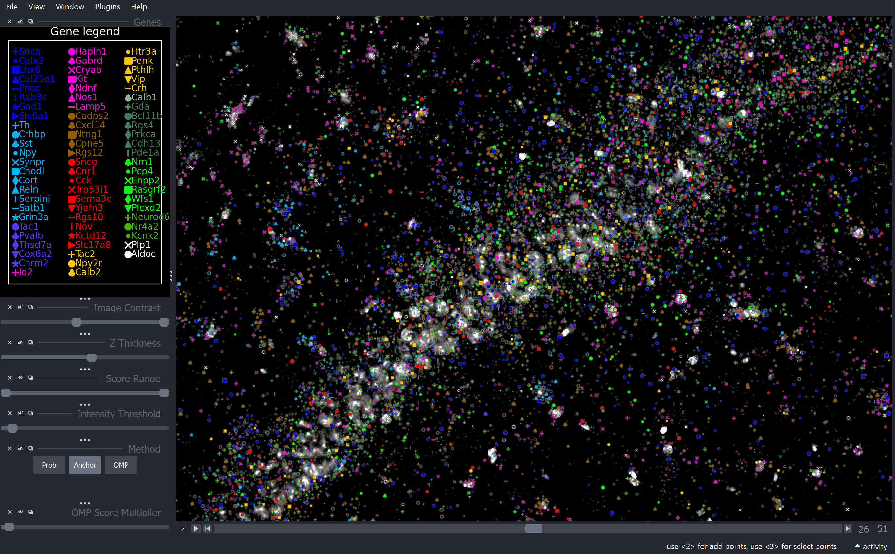

## Viewer

The Viewer is coppafish's flagship way of viewing final results. It is a fast, three-dimensional view of gene reads 
found by coppafish using <a href="https://github.com/napari/napari" target="_blank">napari</a>.

### Opening

A Viewer can be displayed once coppafish has run through at least [call spots](overview.md#call-spots). Do this by

```python
from coppafish import Notebook, Viewer
nb = Notebook("path/to/notebook.npz")
Viewer(nb)
```

where a new napari tab will be opened. You can specify a how genes are marked using a .csv file, then the Viewer can be 
opened by

```python
from coppafish import Notebook, Viewer
nb = Notebook("path/to/notebook.npz")
Viewer(nb, gene_marker_file="path/to/custom/gene_marker_file.csv")
```

see <a href="https://github.com/reillytilbury/coppafish/raw/HEAD/coppafish/plot/results_viewer/gene_color.csv" target="_blank">
here</a> for the default .csv file for gene markers.

### Description

The greyscale signal in the background is the DAPI (if no DAPI is included in the dataset, then the anchor image is 
displayed instead); whiter regions indicate cells. Each gene is given a unique shape and colour, shown in the gene 
legend. A gene can be toggled by left clicking on it in the gene legend, right click a gene to show only that type.

For help with Viewer hotkeys, press Shift + k. This includes further diagnostic plots built into the Viewer.

The "Image Contrast" slider below the gene legend will affect the colour scale of the DAPI image. The "z Thickness" 
allows for multiple z planes of genes to be displayed at once. Genes further away in z are smaller. The "Score Range" 
allows the user to change the minimum and maximum scores to be displayed. The "Intensity Threshold" affects the minimum 
allowed spot intensity to display (only affects Anchor and OMP). The "Method" is the chosen method of gene calling. 
"Prob" is the Von-Mises probability method, "Anchor" is the anchor method (see [call spots](overview.md#call-spots)), and 
"OMP" is the Orthogonal Matching Pursuit method (see [OMP](overview.md#orthogonal-matching-pursuit)). The "OMP Score 
Multiplier" will affect how much weight positive coefficient has over negative coefficient parts of a spot. We 
recommend a value $\ge1$, but there is no known optimal value.



## RegistrationViewer

### Opening

```python
from coppafish import RegistrationViewer, Notebook

nb = Notebook("path/to/notebook.npz")
RegistrationViewer(nb, t=t)
```

where `t` is a tile index you want to view registration results for. If `t` is set to `None` (default), then the lowest 
tile index is displayed.

## PDF Diagnostics

During a pipeline run, multiple .pdf files are created for different sections. These are located in the output 
directory. They can be manually created from the notebook file by
```python
from coppafish import BuildPDF

BuildPDF("path/to/notebook.npz")
```

specify the directory to save to by
```python
BuildPDF("path/to/notebook.npz", "path/to/output/directory")
```
if you want the PDFs to be re-created, you must delete the old ones first.

## Viewer2D

To open
```python
from coppafish import Notebook, Viewer2D

nb = Notebook("path/to/notebook.npz")
Viewer2D(nb)
```

The viewer is updated by typing commands in the terminal. To find out the available commands, type `help` or `h`.

## Viewing images

### Raw images

Raw images for particular tiles, round, and channels can be viewed with access to `nb.file_names.input_dir`:

```python
from coppafish import Notebook, plot

nb = Notebook("/path/to/notebook.npz")
plot.view_raw(nb, tiles, rounds, channels)
```

where `tiles`, `rounds`, and `channels` are lists of integers specifying which images to view.

### Extracted images

Extracted images are identical to raw images, these are viewed by

```python
from coppafish import Notebook, plot

nb = Notebook("/path/to/notebook.npz")
plot.view_extracted_images(nb, tiles, rounds, channels)
```

where `tiles`, `rounds`, and `channels` are lists of integers specifying which images to view. Set these to `None` if 
you wish to view all of the them from the sequencing images.

### Filtered images

Images after all [filtering](overview.md#filter) are viewed by

```python
from coppafish import Notebook, plot

nb = Notebook("/path/to/notebook.npz")
plot.view_filtered_images(nb, tiles, rounds, channels)
```

where `tiles`, `rounds`, and `channels` are lists of integers specifying which images to view. Set these to `None` if 
you wish to view all of the them from the sequencing images.
