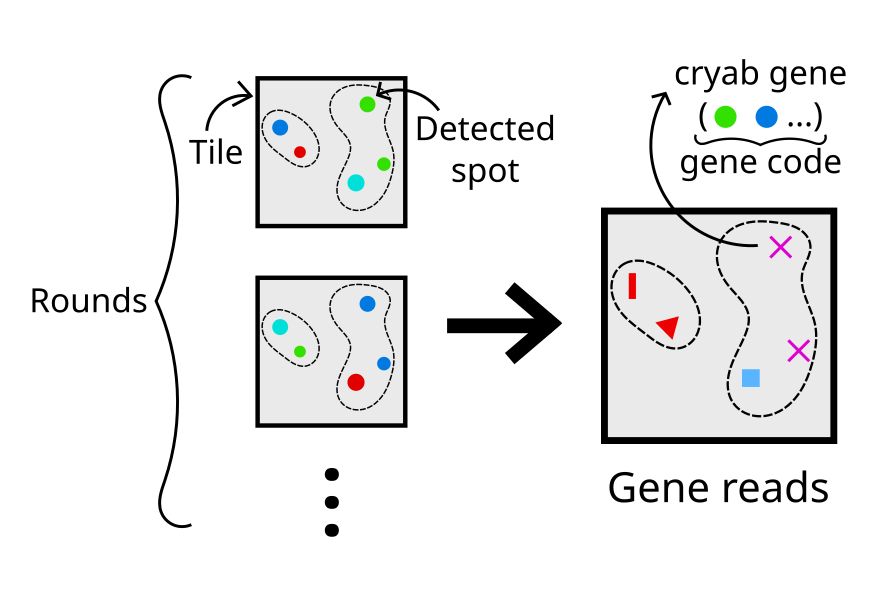

## Coppafish

Coppafish is an open source data analysis software for COmbinatorial Padlock-Probe-Amplified Fluorescence In Situ
Hybridization (coppafish) datasets. A series of 3D microscope images are arranged into tiles, rounds and channels. For
each sequencing round, every considered gene is fluoresced by a dye. By the end of all rounds, each gene has a unique,
barcode-like sequence of dyes, called the gene code. For more details about coppafish's methodology, see the
[method](method.md). See [installation](#installation) on how to install our software, and [usage](basic_usage.md) to
run coppafish on your dataset. Some vocabulary might be unfamiliar, please see the [glossary](glossary.md) for
reference.

<figure markdown="span">
  { width="400" }
  <figcaption>Gene calling on a tile.</figcaption>
</figure>

## Installation

### Prerequisites

* Windows or Linux operating system. MacOS is not tested.
* At least 48GB of RAM for tile sizes `58x2048x2048`.
* Python version 3.9 or 3.10.
* [Git](https://git-scm.com/).

### Environment

Install coppafish software from within an environment. This can be a `venv` or `conda` (recommended) environment.

#### Conda

For `conda`, build an environment by doing:
```console
conda create -n coppafish python=3.10
conda activate coppafish
```

#### venv

```console
python -m venv /path/to/new/virtual/environment
```
then, in Linux and MacOS:
```console
source /path/to/new/virtual/environment/bin/activate
```
or windows:
```console
/path/to/new/virtual/environment/Scripts/activate.bat
```

### Install

Our latest coppafish release can be cloned locally
```console
git clone --depth 1 https://github.com/reillytilbury/coppafish
```

to install the optimised, [pytorch](https://github.com/pytorch) GPU code
```console
cd coppafish
python -m pip install --upgrade pip
python -m pip install -r requirements-pytorchgpu.txt
python -m pip install -e .
```

or for the optimised, [pytorch](https://github.com/pytorch) CPU code
```console
cd coppafish
python -m pip install --upgrade pip
python -m pip install -r requirements-pytorch.txt
python -m pip install -e .
```

or for the slower, numpy-only code
```console
cd coppafish
python -m pip install --upgrade pip
python -m pip install -r requirements.txt
python -m pip install -e .
```

this can be useful for people with limited disk space for large packages like pytorch who do not mind sacrificing
some computation speed.

If you do not wish to keep a local copy of coppafish (i.e. not interested in `git pull`ing higher coppafish versions
later) then remove the `-e` option. The source code can then be deleted after installing.

If pytorch GPU is installed, but no cuda device is found available, then coppafish will automatically revert back to
pytorch CPU.

## Updating

Coppafish will not automatically install updates, but you will see a warning at the start of a pipeline if a new online
version is available.

If you already have the source code downloaded, navigate inside of the `coppafish` directory, then `git pull` the
latest code changes. Then, follow the [install](#install) steps again, excluding the `git clone` command, while inside
your coppafish environment.

If you do not have the source code downloaded anymore, follow all the [install](#install) again while inside your
coppafish environment.

You can verify your install by running `pip show coppafish` in the coppafish environment to check you have the right
version.
